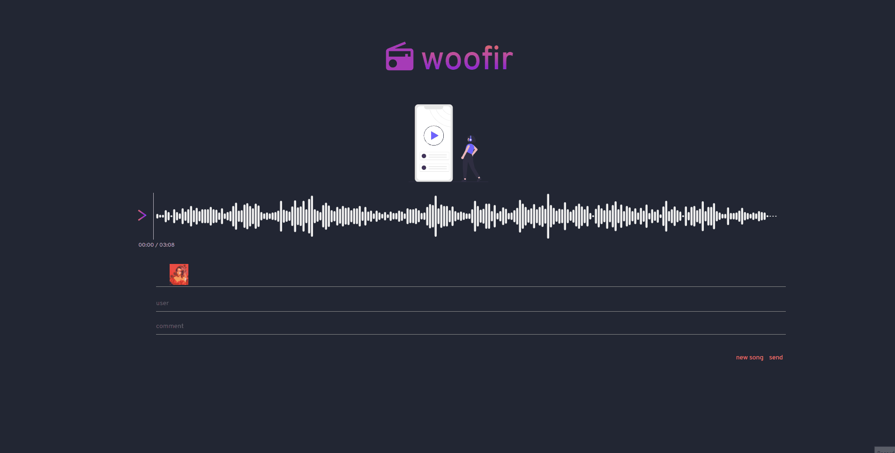

<h1>Commands</h1>
<ul>
  <li>yarn start //starts the client side</li>
  <li>yarn run server //starts python backend</li>
</ul>

<h1>Python Dependencies</h1>
<ul>
  <li>flask</li>
  <li>flask_restful</li>
  <li>flask_mongoengine</li>
  <li>flask_cors</li>
</ul>

<h1>How to run</h1>
<ol>
  <li>git clone https://github.com/tobiasafischer/woofir.git</li>
  <li>cd woofir</li>
  <li>pip install pipenv (if not already installed)</li>
  <li>pipenv shell</li>
  <li>yarn</li>
  <li>yarn run server</li>
  <li>(open new terminal)</li>
  <li>yarn start</li>
</ol>

<h1>How to make everything work</h1>

<ul>
  <li>to play the song press the colored '>' to the left of the wave form</li>
  <li>to scrub the wave form simply press on the time you wish to jump to.</li>
  <li>Preloaded is a song with zero comments, the comments are rendered based on the % of the song you are at (50% of the song comment is 50% of the length)</li>
  <li>Write a comment on the current song playing and the comment will persist and show up (there are 3 songs)</li>
  <li>To change the song press the 'new song' button at the bottom</li>
</ul>

